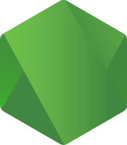

  

    

    
    
    

    Once a kid surrounded by arcade machines, video games, and buckets of computer parts, now a full-stack developer, spending most of my time trying to build the ideas circling my brain.

<h3>Technology Stack</h3>
<table style="width: 100%;">
  <tr width="100%">
    <td width="50%">
      <h4>Core:</h4>
      
      
      
      
    </td>
    <td width="50%">
      <h4>Dev/Ops:</h4>
      
      
      
      
      
    </td>
  </tr>
  <tr>
    <td width="50%">
      <h4>Frontend:</h4>
      
      
      
      
      
    </td>
    <td width="50%">
      <h4>Backend:</h4>
      
      
      
      
      
    </td>
  </tr>
  <tr>
    <td width="50%">
      <h4>Testing:</h4>
      
      
      
      
    </td>
    <td width="50%">
      <h4>Design:</h4>
      
      
      
      
    </td>
  </tr>
</table>

### Stats

<table width="100%">
  <tr>
    <td width="100%">

&nbsp;   

</td>
</tr>
  <tr>
    <td width="50%">

&nbsp;   

  </td>
  <td width="50%">

&nbsp;   

  </td>
  </tr>

</table>

---

### Selected Projects

#### [NextJS Study](https://github.com/moose-hub/nextJSStudy)

A client brief that went from HTML wireframe, to static page react app in vite, to full webapp built with **Next.js**, utilizing some vanilla **CSS** and **Material UI** for styling.

- Componentising re-usable elements
- Building dynamic components by mapping datasets
- Handling form submission post requests to docustore {json}
- Mobile first design and develop principles

#### [HTML Rock, Paper, Scissors](https://github.com/moose-hub/html-RPS)

A replayable rock paper scissors game, built with replayability, scoring, and interactive UI.

- Refactor code from console RPS game to HTML UI
- Build and style video game UI
- Replayability loop
- Scoring outcomes for win, loss, and draw